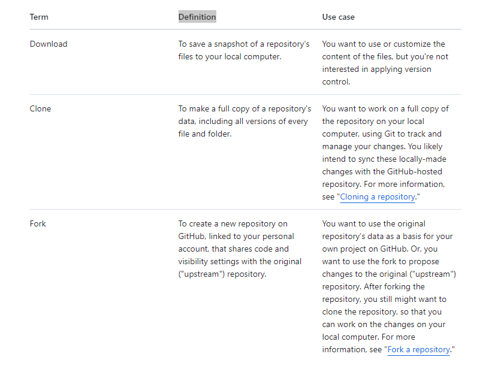
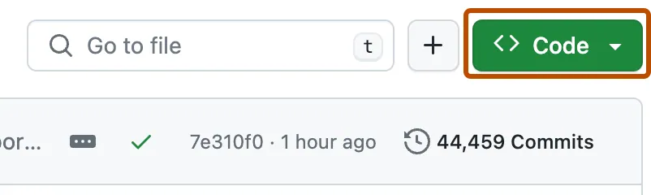

# 从github下载文件
学习如何从github下载文件，并了解下载、克隆、fork之间的不同点

## 简介
github.com是数百万开源软件的老家， 你可以复制、自定义、并使用他们达到自己的目的

有几种不同的方法去复制github仓库的文件。 你可以：
- 可以下载仓库的快照文件zip到你电脑本地
- 使用git克隆仓库到你本地电脑
- fork一个仓库，在github创建一个新的仓库

每一种方法都有自己的应用场景，我们接下来会介绍

本教程关注与下载仓库文件到你本地电脑。 例如， 如果你在github发现一些有趣的仓库内容，直接下载内容是一个简单的复制方法。不用使用git或者应用版本控制

## 理解下载、克隆、fork之间的不同点

## 前提条件

- 你必须有一个github账号

## 下载一个仓库的文件

为了教学，我们使用模板仓库[octocat/spoon-knife](https://github.com/octocat/Spoon-Knife)
1. 导航到仓库octocat/Spoon-Knife。
2. 点击文件列表上方的<>code。

3. 点击Download ZIP

## 结论

你现在有个仓库文件zip在你的电脑。 你可以编辑和自定义文件内容来实现你个人的目的

## 下一步

- 下一个课程[上传项目到github](https://docs.github.com/en/get-started/start-your-journey/uploading-a-project-to-github), 你将学习如何上传你自己的文件到github远程仓库

## 延伸阅读

[下载源代码归档](https://docs.github.com/en/repositories/working-with-files/using-files/downloading-source-code-archives)