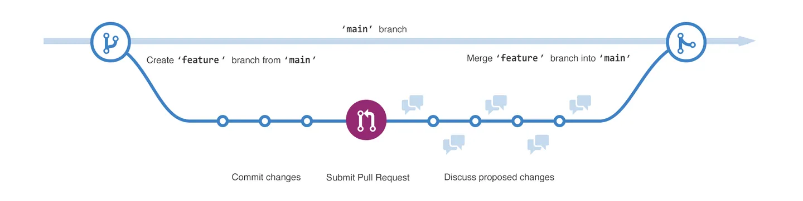
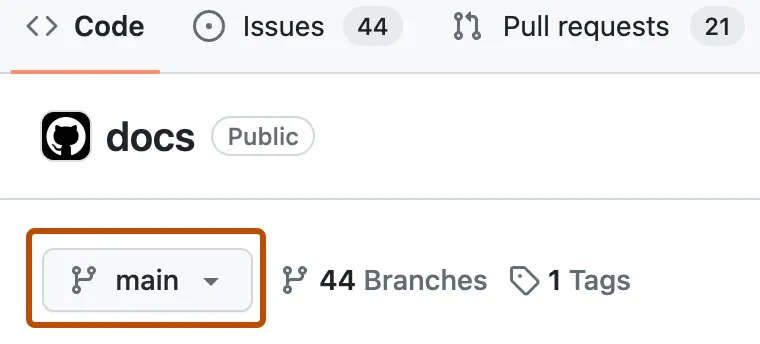

## Hello World

按照教程练习来学习请求拉取的流程

### 介绍

这个教程介绍了一些github中仓库、分支、提交、请求拉取等关键元素。

你将学习创建自己的hello world仓库，并学习请求拉取工作流，这是创建和审查代码的常用方式。

在这份快速入门指南中，您将学到

- 创建和使用仓库
- 创建和管理分支
- 进行代码变更并通过commit的方式将变更同步到远程github仓库
- 打开并合并拉取请求

### 前提条件

- 必须有一个github账号，详细信息请查看:[创建一个账号](https://docs.github.com/en/get-started/start-your-journey/creating-an-account-on-github)
- 你不需要知道如何编码，使用命令行工具或者安装git就行了

### 第一步创建一个仓库

我们要做的第一件事是创建一个仓库，你可以认为仓库是一个包含文件、图片、视频或者其他目录的目录。仓库通常用于组织与之相关的某个项目的所有元素或者你要工作的事项。

通常，仓库会包含一个介绍你项目相关信息的readme文件，readme文件是用markdown编写的，它是一种易于读写的用于格式化文本的语言。我们下一章将学习更多的markdown知识。

github可以在创建仓库的同时创建readme文件，它也提供了其他的选项如授权文件，现在我们都用勾选这些选项。

hello world仓库一个你可以存储想法，文件、资源甚至是可以与他人讨论事项的地方

1. 每一个页面右上角点击➕然后点击创建仓库
2. 在名称输入框输入仓库名称
3. 在描述框输入简单的描述信息，例如：这个仓库是用于联系github工作流的
4. 选择开放或者私有
5. 选择添加readme文件
6. 创建仓库

### 第二步创建分支

分支可以让你的仓库同时拥有多个版本

默认情况下，您的仓库有一个main分支，它被认为是最终分支，可以在仓库创建其他的分支

分支在不改变主分支源代码的基础上给项目添加新特性非常有帮助，合并代码前，其它分支的变动不会影响到main分支，提交代码之前，您可以用其他分支修改代码和做实验。

当你创建一个分支，其实是创建了主分支那个时间点的副本或者快照，如果其他人在你编辑分支的时候对main分支做了修改，你可以拉取最新的内容

下方的图展示了

- 主分支
- feature分支
- feature合并到主分支的整个工作流程

#### 创建分支

- 点击仓库的code标签
- 在文件列表上方，点击main的下拉菜单

- 输入分支名称edit-readme
- 创建分支

现在你有两个分支，main和edit-readme，此刻他们看起来完全一样，下一步，你可以在新分支修改代码

### 步骤3创建和提交修改

上一部操作后，你已经有了一个新的分支，github带您进入新分支的代码页，他是main分支的副本

在你的分支上，你可以制造并保存对文件的变更，在github保存变更叫commit，每一个提交都有相关联的提交消息，用于陈述为何要做变更，提交消息捕获变更的历史纪录，因此合作者可以明白你代码变更的原因

1. 切换到你创建的readme-edit分支， 点击readme文件
2. 点击笔头按钮，开始编辑文件
3. 在编辑器编写一些关于你的信息
4. 点击commit changes按钮
5. 在提交变更输入框输入修改信息
6. 点击commit changes按钮

这些对readme文件的改变只会存在于你的readme-edits分支，因此你的分支就有了和main分支不同的内容

### 步骤四打开pull request

既然你已经在main之外的分支做了变更，就可以打开pull request了

pull request是在github和合作开发的核心，当你打开ull request就是想要有人去审查并接受你的贡献，并且将变更合并到他们的分支。pull request显示了两个分支的不同点，会将变更，增加，减少用不同的颜色展示

只要你提交了一次代码，就可以发起一个pull request。 甚至是在你完成编码之前

在这里，你将在自己的仓库发起pull request 然后将它合并的自己的main分支，这是在大项目合作前对github工作流很好的联系操作

1. 在hello world仓库点击pull request标签
2. 点击new pull request 按钮
3. 在比较框中选择你创建的分支readme-edit和main分支做比较
4. 在比较页面浏览差异，确认是不是你想提交的内容
5. 点击create pull request按钮
6. 给你的pull request定一个标题和剪短的描述，这里可以放入表情符号和拖拽图片和动图到里面
7. 点击create pull request按钮

#### 审核pull request

当你开始与他人协作，你就需要得到别人的审核。这样合作者就可以在你合并代码到main分支之前对你的代码进行评论或者提出修改建议

本节内容我们不会涉及对pull request的审核流程，若感兴趣可以查看相关教程

### 步骤五合并pull request

最后一步，你需要将readme-edit分支合并到main分支，合并之后，readme-edit分支的变更会归并于main分支

有时间会出现变更代码与main分支已有代码冲突的场景， 这时候github会提醒你去处理冲突，直到冲突处理完成后才能合并代码，你可以commit代码来解决冲突或者是和伙伴一起讨论冲突内容应该如何解决

在这次演示过程中，你的代码不会出现分支，因此你已经准备好了合并分支到主分支

1. 在pull request的下方，点击merge pull reqeust 按钮去合并分支
2. 点击confirm merge按钮，你将收到一条消息，表示请求已经合并且成功关闭
3. 点击删除分支，这时你已经成功合并代码到main分支，readme-edit分支可以删除，如果还有需要变更的地方可以重新拉取一个分支并重复以上操作
4. 回退到hello-world仓库code标签页面去查看在main分支发布的改变

## 结论

看完此教程，你已经学会了创建一个项目并在github做一个pull request
作为一部分，我们学会了如何：

- 创建一个仓库
- 创建并管理新分支
- 变更文件并提交变更到github
- 打开并合并一个pull request

## 下个步骤

- 浏览一个你的github个人信息页面， 会发下你的工作将会体现在贡献图上
- 若你还想再联系本教程学到的内容可以查看相关文档
- 下一章是设置个人信息， 你将学会如何个性化你的个人信息，并学习一些markdown语法用于github