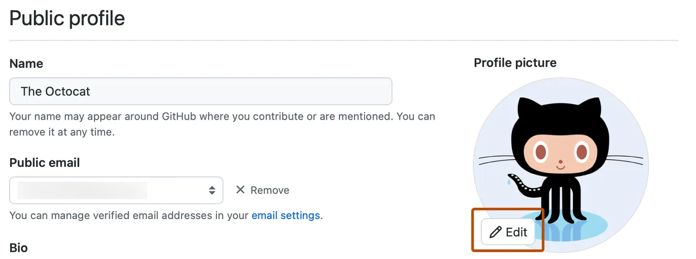
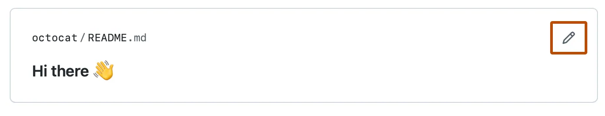

# 设置你的个人资料

你的个人资料告诉别人你是谁，你的个人兴趣

## 关于你的个人资料

你的github个人资料页面是别人可以更深入了解你的地方，你可以使用你的个人资料去：

- 分享你的兴趣和技巧
- 展示你的项目和贡献
- 表达你的身份，向github社区展现你是谁

在这一个教程中，你将学习如何通过添加头像、简介、readme文件来个性化你的个人资料

你也会学习markdown语法的基础知识，用于格式化你在github上的所有文本内容

### 前提条件

你必须有一个github账号， 详细资料请查看[如何创建一个github账号](https://docs.github.com/en/get-started/start-your-journey/creating-an-account-on-github)

## 添加一个个人资料图片和简介

首先，我们会给你的个人资料添加一张照片， 个人资料的照片有助于在github中识别到你

### 添加一张个人资料照片

1. 点击页面右上角的个人信息头像，然后在下拉菜单中点击设置选项
2. 在个人资料图片下方点击✏️编辑按钮，然后选择上床图片

3. 选择一张图片，然后选择上传
4. 裁剪你的图片
5. 点击设置新资料图片按钮

接下来，我们将添加一些关于你的个人信息与他人分享，这些信息将会展示在个人资料页面图片的下方

### 添加简介

1. 在个人资料页面，点击图片下方的edit profile
2. 在个人简介下写一两句关于你自己的话，比如你是谁，你是做什么的
> 提示：尽量简短的写简介，我们会在下面的步骤学习如何在reame文件描述个人的兴趣
3. 可以在简介对话框添加emoji图像，通过浏览[emoji](https://www.webfx.com/tools/emoji-cheat-sheet)复制粘贴图到简介框
4. 可选择的添加代名词、地点、时间、个人相关网站链接或者社交账号，您的代名词又有登录github的用户才能看到
5. 点解保存

## 添加个人资料readme文件

下面我们将创建一个特殊的仓库和readme文件，可以直接展示在你的个人资料页面

readme文件包含了你的兴趣爱好、技巧、背景等信息，这是一个向大家介绍你自己并展示工作的好办法

正如我们在在hello world教程学的那样，readme文件是用markdown语法编写的

在下面的步骤中，我们将创建并编辑readme文件

### 步骤一为你的个人资料readme文件创建一个新仓库
1. 页面右上角点击➕，在下拉菜单点击创建新仓库

2. 输入和你用户名相匹配的仓库明，例如，你的用户名是oct，那你的仓库名也必须是oct
3. 在描述字段输入仓库描述，例如我的个人仓库
4. 选择公开
5. 勾选初始化仓库readme文件
6. 创建仓库

### 步骤二修改readme文件

1. 点击readme文件编辑按钮

2. 在编辑页面，你将会看到一些预填充内容，删除第一行，改为自己的内容
    - 在markdown中 ### 会渲染出三级标题，## 和 # 分别代表二级标题和一级标题
3. 切换到预览页面，你将会看到新添加的内容展示为更大的标题
4. 切回到编辑页面
5. 总之将内容编辑为介绍个人的内容

### 第三部发布变更到个人信息

1. 当你觉得内容已经修改好了，预览也没有问题，就点击commit change按钮
2. 在打开的对话框再次点击commit change
3. 导航回个人资料页面，你将看到readme文件的内容显示在个人资料页面

## 下一步

- 如果想学习更多的markdown语法，使用更加丰富的格式，可以查看文档
- 可选择的，尝试github技巧课程
- 下一章是在github发现灵感， 我们将介绍如何在github找到你感兴趣的项目和人