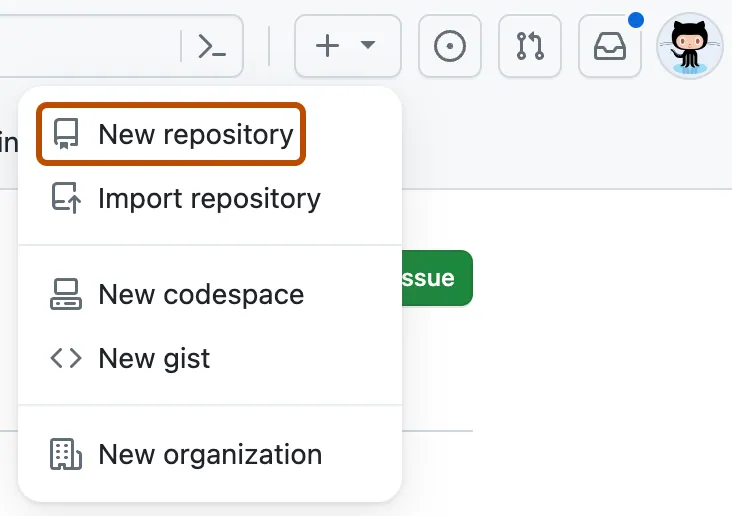

# 上传项目到github

学习如何上传项目文件到github

## 介绍

这个教程将像你展示如何上传一组文件到github仓库。
上传文件到github仓库让你：
- 修改文件时是用版本控制，因此你的项目变更记录可以被保护和管理
- 备份你的工作，因为你的文件现在存储在云端
- 将仓库固定到你的个人资料，可以让别人看到你的工作
- 和别人分享和讨论你的工作，无论是共有还是私有

如果你已经非常熟悉git， 并且在寻找将本地git仓库上传到gihub的方法，查看[添加本地代码到github](https://docs.github.com/en/migrations/importing-source-code/using-the-command-line-to-import-source-code/adding-locally-hosted-code-to-github#adding-a-local-repository-to-github-using-git)

## 前提条件

- 你必须有一个github账号， 了解更多查看[创建一个github账号](https://docs.github.com/en/get-started/start-your-journey/creating-an-account-on-github)
- 你应该先准备一组文件用于上传

## 步骤一：为你的项目创建一个新的仓库

为你每一个单独的工作项目创建一个仓库是一个好主意。如果你在写一个软件项目，将项目的相关文件进行分组以便更容易去维持和管理代码

1. 在页面右上角选择+， 然后点击创建新仓库

2. 在仓库名称输入框，输入你的项目名称，例如：我的第一个项目
3. 在描述输入框，输入描述，例如：输入这是我的第一个github项目
4. 选择共有还是私有仓库， 如果你想让别人能看到你的项目请选择共有
5. 选择添加readme文件，你将在后面的步骤中编辑这个文件
6. 点击创建仓库按钮

## 步骤二：上传文件到你的项目仓库

目前为止， 你应该只能看到一个文件在你的项目里面， 就是readme文件，在你创建仓库时初始化的。现在，我们将上传一些你自己的文件

1. 在页面右侧， 选择添加文件下拉框
2. 在下拉菜单中，点击上传文件
3. 在你的电脑上， 打开你的文件工作目录， 然后拖拽所有的文件和文件夹到浏览器
4. 在页面底部， 提交变更按钮上方，选择直接提交到main分支， 然后点击提交变更

