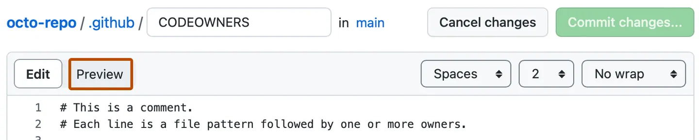

# 上传项目到github

学习如何上传项目文件到github

## 介绍

这个教程将像你展示如何上传一组文件到github仓库。
上传文件到github仓库让你：
- 修改文件时是用版本控制，因此你的项目变更记录可以被保护和管理
- 备份你的工作，因为你的文件现在存储在云端
- 将仓库固定到你的个人资料，可以让别人看到你的工作
- 和别人分享和讨论你的工作，无论是共有还是私有

如果你已经非常熟悉git， 并且在寻找将本地git仓库上传到gihub的方法，查看[添加本地代码到github](https://docs.github.com/en/migrations/importing-source-code/using-the-command-line-to-import-source-code/adding-locally-hosted-code-to-github#adding-a-local-repository-to-github-using-git)

## 前提条件

- 你必须有一个github账号， 了解更多查看[创建一个github账号](https://docs.github.com/en/get-started/start-your-journey/creating-an-account-on-github)
- 你应该先准备一组文件用于上传

## 步骤一：为你的项目创建一个新的仓库

为你每一个单独的工作项目创建一个仓库是一个好主意。如果你在写一个软件项目，将项目的相关文件进行分组以便更容易去维持和管理代码

1. 在页面右上角选择+， 然后点击创建新仓库

2. 在仓库名称输入框，输入你的项目名称，例如：我的第一个项目
3. 在描述输入框，输入描述，例如：输入这是我的第一个github项目
4. 选择共有还是私有仓库， 如果你想让别人能看到你的项目请选择共有
5. 选择添加readme文件，你将在后面的步骤中编辑这个文件
6. 点击创建仓库按钮

## 步骤二：上传文件到你的项目仓库

目前为止， 你应该只能看到一个文件在你的项目里面， 就是readme文件，在你创建仓库时初始化的。现在，我们将上传一些你自己的文件

1. 在页面右侧， 选择添加文件下拉框
2. 在下拉菜单中，点击上传文件
3. 在你的电脑上， 打开你的文件工作目录， 然后拖拽所有的文件和文件夹到浏览器
4. 在页面底部， 提交变更按钮上方，选择直接提交到main分支， 然后点击提交变更

## 步骤三：编辑你项目仓库的readme文件

别人打开你的仓库首先会看到的就是你的readme文件，它包含了你的项目是什么，它有社么用处等信息。
正如我们在“hello world”教程中所学习的，它使用markdown语法写的。markdown是一种格式化文本易读易写的语言。
这节我们将会写入易写关于你项目的信息到readme文件。
1. 在文件列表中点击readme文件，查看文件内容
2. 在右上角点击✏打开编辑器
    - 你将看到一线预先填充的项目信息，例如，你将看到第一步中你命名的仓库名称和仓库描述在第一行和第二行。
3. 删除井号之外的其他文本，然后定义一个真正的项目标题
    - 例如：我的第一个github项目
4. 下一步，添加一些项目信息，例如你的项目计划或者主要特性
    - 如果你还不知道写什么，看一下其他仓库，别人是怎么描述他们的项目的
    - 若要添加一些更佳丰富的格式，如图片，链接，脚注，请查看：[基本信息和格式语法](https://docs.github.com/en/get-started/writing-on-github/getting-started-with-writing-and-formatting-on-github/basic-writing-and-formatting-syntax)
5. 在内容上方点击预览

6. 看一下，一旦我们保存更改，内容会如何渲染，然后切回编辑
7. 继续编辑和预览内容，知道你满意为止
8. 在右上角点击提交更改
9. 在弹出的对话框中，预填充的提交信息已经写好，直接提交到main分支选项也已经勾选，保持默认选项，点击提交变更按钮

## 结论
现在你已经创建了一个仓库，上传了一些文件，并添加了readme文件，如果你设置仓库的可见性为共有，仓库将会展示在你的个人信息页面，你还可以分享仓库链接给他人
当你在浏览器直接添加，编辑，删除文件，github已经跟踪了这些变更， 你可以管理项目历史和进化。

当你做变更时，记得可以新建一个分支，这样你就可以在不影响main分支的前提下做文件变更了。这样你就可以随意变更文件了，最后提交pull request去将变更合并到main分支。提醒你如何完成这些操作查看“hello world”课程

## 下一步

很多人喜欢在本地修改文件，最后将修改同步到远程仓库，有很多工具帮助你完成，比如github desktop， 如何开始，你需要去
- 下载github desktop
- 克隆远程仓库到本地
- 不断同步本地修改到远程仓库

学习更多管理远程仓库的工具请查看相关文档

## 延申阅读
- 关于readme
- 管理文件
- 克隆仓库
